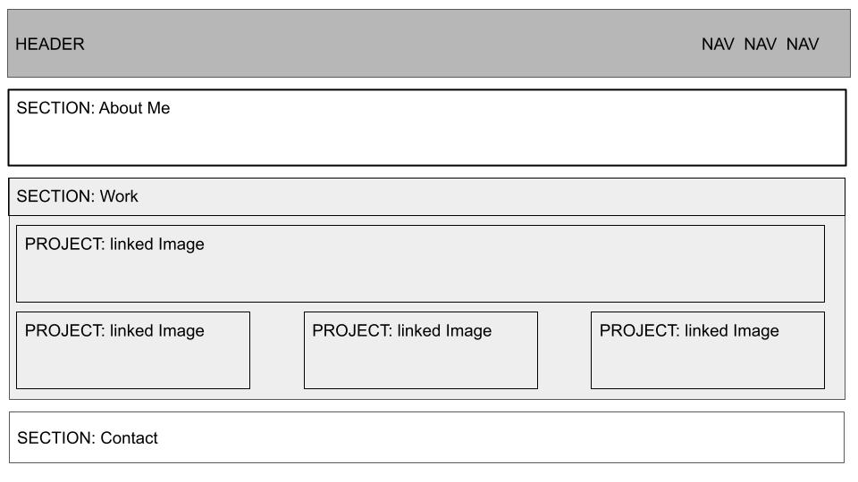

# Personal Portfolio

## The Purpose of This Project

In this project, my goal was to create a portfolio page showcasing my body of work as a web developer. This page is intended to be shared with ptential employers along with my Resume, LinkedIn profile, and GitHub profile. 

In building this page, I am able to showcase my understanding of HTML, CSS, flexbox, media queries, and other core skills.

## Wireframe

The wireframe below displays my initial thoughts on the design of this page 



## Code examples

Here is an example of of how I created labeled and linked/clickable images that navigate to my deployed projects.
HTML
```html
<div class="primary-project">
    <a href="https://atmason90.github.io/site-refactor/" target="_blank"></a>
    <h3 class="project-label">SITE REFACTOR</h3>
</div>
```
CSS
```css
.primary-project {
    position: relative;
    border-style: solid;
    border-color: darkslategray;
    border-width: 2px;
    margin: 5px;
}

.project-label { 
    display: block;
    width: 100%;
    position: absolute;
    bottom: 20px;
}
```

Here is an example of how I used CSS flexbox to format and element of my page.
```css
header {
    background-color: darkslategray;
    color: rgb(233, 229, 204);
    display: flex;
    flex-direction: row;
    justify-content: space-between;
    align-items: center;
    flex-wrap: wrap;
}
```

Here is an example of how I used media queries to create a dynamic layout that adjusts to screen sizes on different devices.
```css
@media screen and (max-width: 480px) {
    .contact-info {
        flex-direction: column;
    }
    .nav-links {
        flex-direction: column;
    }
```

## License

MIT License

Copyright (c) 2022 Andrew Mason

Permission is hereby granted, free of charge, to any person obtaining a copy
of this software and associated documentation files (the "Software"), to deal
in the Software without restriction, including without limitation the rights
to use, copy, modify, merge, publish, distribute, sublicense, and/or sell
copies of the Software, and to permit persons to whom the Software is
furnished to do so, subject to the following conditions:

The above copyright notice and this permission notice shall be included in all
copies or substantial portions of the Software.

THE SOFTWARE IS PROVIDED "AS IS", WITHOUT WARRANTY OF ANY KIND, EXPRESS OR
IMPLIED, INCLUDING BUT NOT LIMITED TO THE WARRANTIES OF MERCHANTABILITY,
FITNESS FOR A PARTICULAR PURPOSE AND NONINFRINGEMENT. IN NO EVENT SHALL THE
AUTHORS OR COPYRIGHT HOLDERS BE LIABLE FOR ANY CLAIM, DAMAGES OR OTHER
LIABILITY, WHETHER IN AN ACTION OF CONTRACT, TORT OR OTHERWISE, ARISING FROM,
OUT OF OR IN CONNECTION WITH THE SOFTWARE OR THE USE OR OTHER DEALINGS IN THE
SOFTWARE.

## Technologies Used


